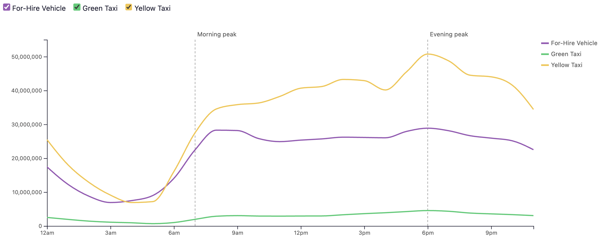
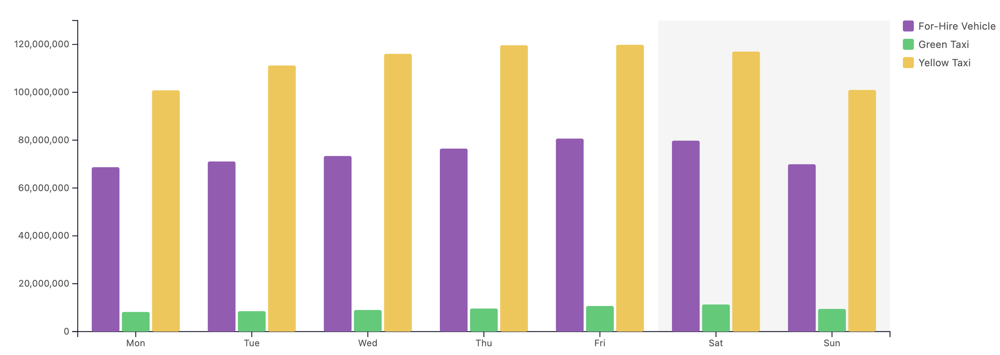
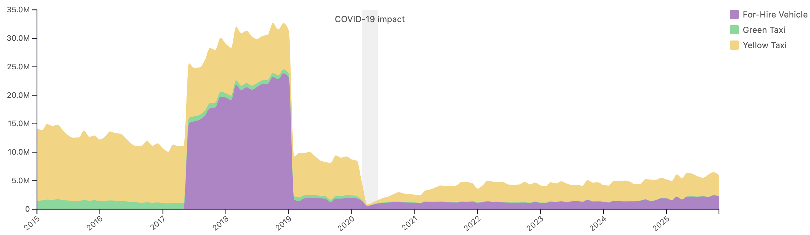
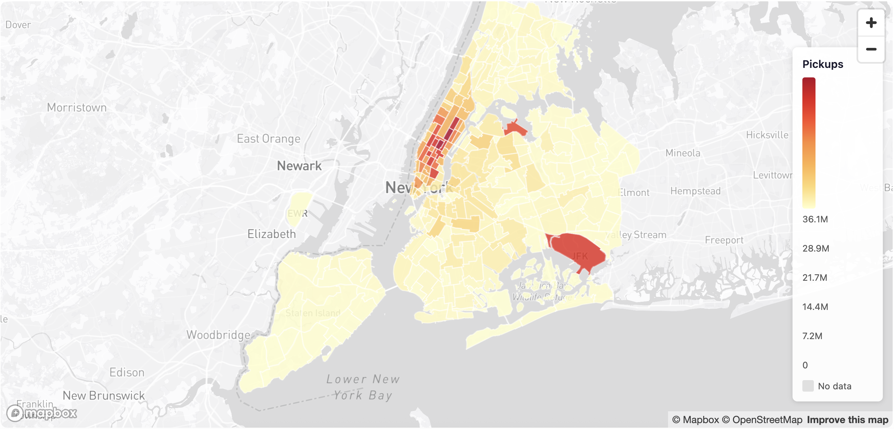
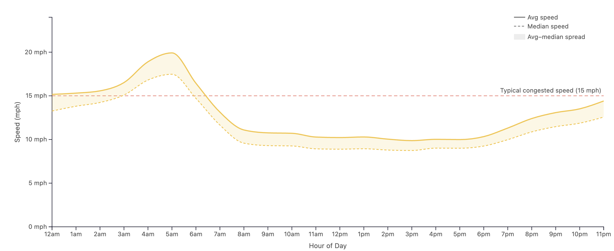
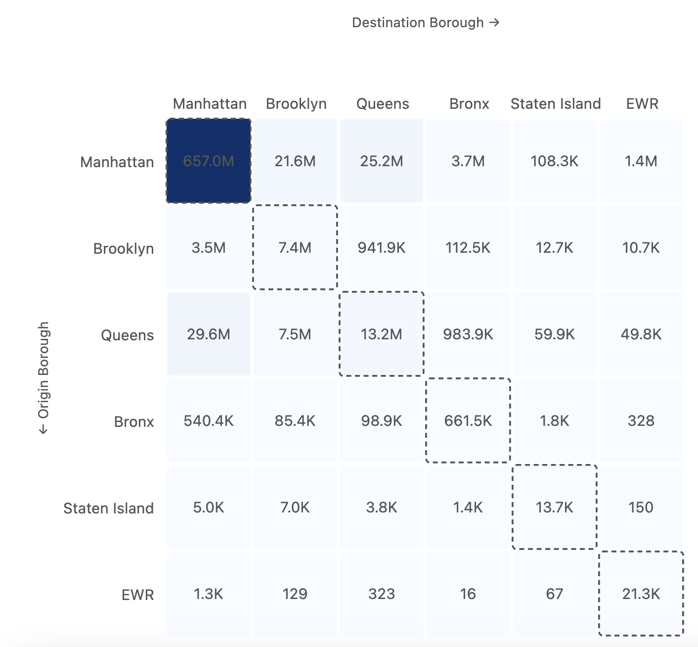
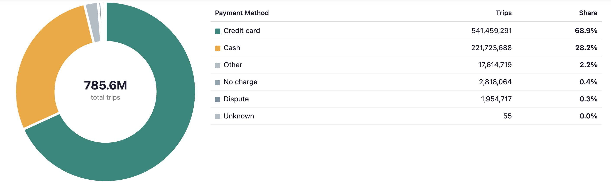
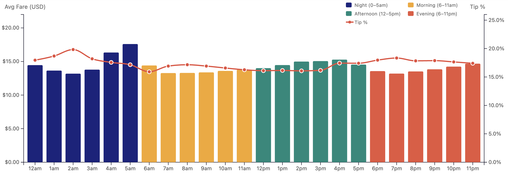

# Static snapshots of interactive EDA visualizations
> **Note**: The interactive visualization can be created with the following commands:
```bash
touch .env && echo "MAPBOX_TOKEN=<your_mapbox_token>" > .env (optional for map styling)
npm install && npm run build && npm run dev
```

We attach below some static snapshots to highlight the trends observed from the EDA.

## Average trends across vehicle types
<div style="display:grid;grid-template-columns:repeat(2, minmax(0, 1fr));gap:12px;">
  <figure style="margin:0;">
    
    <figcaption><u><b>Trip demand by hour of day</b></u>: sharp increase in trips at particular hours, denoted with morning and evening peaks.</figcaption>
  </figure>
  <figure style="margin:0;">
    
    <figcaption><u><b>Trip demand by day of week</b></u>: similar patterns across vehicle types, with peaks during weekdays.</figcaption>
  </figure>
  <figure style="margin:0;">
    
    <figcaption><u><b>Trip demand by month</b></u>: sharp decline in all vehicle types corresponding to the COVID-19 pandemic, pronounced between April and June 2020.</figcaption>
  </figure>
  <figure style="margin:0;">
    
    <figcaption><u><b>Pickup locations count</b></u>: most trips start in Manhattan, but there are clear hotspots in  JFK and LaGuardia airports.</figcaption>
  </figure>
</div>

### Trends for Yellow Taxis
<div style="display:grid;grid-template-columns:repeat(2, minmax(0, 1fr));gap:12px;">
  <figure style="margin:0;">
    
    <figcaption><u><b>Yellow taxi speed by hour of day</b></u>: overnight hours have the fastest speeds, going up to 20 mph, with a decrease in the midday and afternoon hours, with as low as 10 mph.</figcaption>
  </figure>
  <figure style="margin:0;">
    
    <figcaption><u><b>Yellow taxi borough distribution</b></u>: most trips show similar origin and destination boroughs (e.g., 657M trips from Manhattan to Manhattan), however, for Queens and Bronx, there are also significant trips to Manhattan (29.6M and 3.5M respectively).</figcaption>
  </figure>
  <figure style="margin:0;">
    
    <figcaption><u><b>Yellow taxi payment method breakdown</b></u>: most trips are paid by credit card (68.9%), followed by payment in cash (28.2%).</figcaption>
  </figure>
  <figure style="margin:0;">
    
    <figcaption><u><b>Yellow taxi average fare by hour of day</b></u>: average fare is higher during the morning and evening rush hour, with tip percentage increasing up to 20% with late night rides.</figcaption>
  </figure>
</div>


> Note: The trends for other vehicles types can be observed in the interactive dashboard, following the instructions in the beginning of this file.


